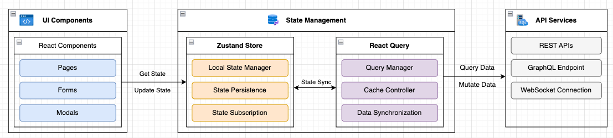

# DP - **Simplifying Front-End Data Flow Management with Zustand**

### Summary

This design pattern utilizes a combination of Zustand and React Query to manage frontend data flow. It aims to minimize boilerplate code, enhance the overall developer experience, and alleviate several issues that may arise when using React Context to manage state:

1. **Prop Drilling**: Context was designed to avoid the inconvenience of manually passing a prop through multiple levels, but overusing it can recreate the prop drilling issue, where components at every level of the tree need to subscribe to the Context.
2. **Difficult to track state changes**: When data in a context is used as global, it can be changed from anywhere, making it difficult to track the source of data changes and debug issues.
3. **Performance Issues**: When the value in Context changes, it triggers a re-render for all components consuming that Context. If the context data is large and changes frequently, it can lead to unnecessary re-renders and performance degradation.
4. **Context Nesting Hell**: If a component needs to access multiple Contexts, it requires nesting multiple Providers, making the code verbose and difficult to maintain.
5. **Difficulty in Code Splitting**: Overusing Context can make state management centralized and tightly coupled, which is detrimental to team collaboration and code splitting.
6. **Maintainability Issues**: As the application grows, excessive use of Context can make state management chaotic, with unclear data flow, making it difficult to maintain and extend the codebase.

---

### Prerequisites and Limitations

#### Prerequisites

- Basic understanding of React and state management concepts
- Experience with React Context API
- Node.js and pnpm/yarn installed
- React project using version 16.8+ (for Hooks support)
- Zustand installation: `pnpm add zustand @tanstack/react-query `

#### Limitations

- Requires refactoring existing Context-based code
- May need to maintain both Context and Zustand during transition period
- Some legacy code might need updates to work with Zustand

---

### Architecture

The following diagram illustrates the workflow of this pattern.

The workflow consists of the following steps:



This architecture consists of three main layers that work together to manage data flow in a React application:

1. **UI Components Layer**:
   React components subscribe to and update local state through Zustand hooks, and handle server data through React Query hooks. When state changes occur, relevant components automatically re-render. State updates triggered by user interactions are processed through Zustand actions or React Query mutations, ensuring the UI always reflects the latest state.

2. **State Management Layer**:
   Zustand manages local application state, including UI state, state persistence, and subscription mechanisms. React Query handles server state, responsible for data fetching, caching, and synchronization. They work together to ensure local and server states remain synchronized while optimizing performance through caching mechanisms.

3. **API Services Layer**:
   Handles communication with backend services, receiving requests from the state management layer and returning data. React Query manages the request lifecycle, including caching, retries, and error handling, while supporting real-time data updates to ensure data consistency and timeliness.

**Data Flow**:

1. **UI Layer to State Management Layer Integration**:
   Components use Zustand hooks to get and update local state, and React Query hooks to handle server data. When state changes, components update their display. When users perform actions, local state updates through Zustand actions, while server operations are handled through React Query mutations.

2. **State Management Layer Internal Integration**:
   When React Query fetches data from the server, it triggers state updates in the Zustand store, keeping local and server data in sync. The two tools work together: React Query handles server data interactions, while Zustand maintains local state.

3. **State Management Layer to API Layer Integration**:
   When server data is needed, React Query handles API communication. When components trigger updates, React Query manages request sending and response handling, interacts with the server through API, and syncs updates to the interface.

This architecture provides several benefits:
- Clear separation of concerns between UI, state management, and API layers
- Efficient state management with Zustand for local state
- Robust data synchronization with React Query for server state
- Flexible API integration supporting multiple protocols

**Technology stack**

- [React](https://react.dev/)
- [Zustand](https://zustand-demo.pmnd.rs/)
- [React Query](https://tanstack.com/query/v5/docs/framework/react/overview)

---

##### Tools

- [Node.js](https://nodejs.org/en)
- [Vite](https://v3.vitejs.dev/)
- [Axios](https://axios-http.com/)

##### Code

The code for the sample application that's used in this pattern is available in GitHub [GitHub](https://github.com/Shurong-Wang_JLLT/zustand-query-demo) repository.

---

### Best Practices (Optional)

- **Gradual Migration**

  - Start with the most problematic Context implementations
  - Migrate one feature at a time
  - Test thoroughly after each migration
- **State Organization**

  - Keep related state in the same store
  - Split large stores into smaller, focused ones
  - Use selective subscriptions to prevent unnecessary re-renders
- **Optimistic Updates (if needed)**:

  - For a better user experience, consider implementing optimistic updates where you immediately update the local state in Zustand while waiting for the server response. This can enhance the perceived performance of your application.

---

### How-To

- Problems with React Context

  ```react
  // Example of problematic React Context implementation
  import create from 'zustand';
  const AppContext = React.createContext();

  const AppProvider = ({ children }) => {
    const [state, setState] = useState({
      user: null,
      theme: 'light',
      data: []
    });

    return (
      <AppContext.Provider value={{ state, setState }}>
        {children}
      </AppContext.Provider>
    );
  };

  // This component will re-render on ANY state change
  const UserProfile = () => {
    const { state } = useContext(AppContext);
    return <div>{state.user?.name}</div>;
  };
  ```
- Implementing Zustand Store

  ```react
  // Create a Zustand store
  import create from 'zustand';

  const useStore = create((set) => ({
    user: null,
    theme: 'light',
    data: [],
    setUser: (user) => set({ user }),
    setTheme: (theme) => set({ theme }),
    setData: (data) => set({ data }),
  }));

  // Components only re-render when their specific dependencies change
  const UserProfile = () => {
    const user = useStore((state) => state.user);
    return <div>{user?.name}</div>;
  };
  ```

  - Hybrid Approach: Using Both React Context and Zustand

    ```react
    // Keep Context for certain features while using Zustand for others
    import React from 'react';
    const ThemeContext = React.createContext();

    const ThemeProvider = ({ children }) => {
      const [theme, setTheme] = useState('light');
      return (
        <ThemeContext.Provider value={{ theme, setTheme }}>
          {children}
        </ThemeContext.Provider>
      );
    };

    // Zustand store for dynamic data
    import create from 'zustand';
    const useDataStore = create((set) => ({
      data: [],
      setData: (data) => set({ data })
    }));
    ```
- Persisting State with Zustand

  ```react
  import { create } from 'zustand';
  import { persist } from 'zustand/middleware';

  const useStore = create(
    persist(
      (set, get) => ({
        language: 'en',
        setLanguage: (newLanguage) => set({ language: newLanguage }),
      }),
      { name: 'language-storage'}
    )
  );
  ```

  - Combining Zustand and React Query

    ```react
    import create from 'zustand';
    import { useQuery } from 'react-query';

    const useStore = create((set) => ({
      users: [],
      setUsers: (users) => set(() => ({ users })),
    }));

    function UsersList() {
      const { users, setUsers } = useStore();

      const { data, isLoading, isError } = useQuery('users', async () => {
        const response = await fetch('/api/users');
        return response.json();
      });

      useEffect(() => {
        if (data) {
          setUsers(data);
        }
      }, [data, setUsers]);

      if (isLoading) {
        return <p>Loading...</p>;
      }

      if (isError) {
        return <p>Error fetching users.</p>;
      }

      return (
        <ul>
          {users.map((user) => (
            <li key={user.id}>{user.name}</li>
          ))}
        </ul>
      );
    }
    ```
- Using Zustand Outside React Components

  ```react
  // tools.js
  import useStore from './store';

  export const getUserCount = () => {
      return useStore.getState().users.length;
  };

  export const setTopThreeUsers = (users) => {
      const topThreeUsers = users.slice(0, 3);
      useStore.setState({ users: topThreeUsers });
  };
  ```

---

### Related resources

- [Use cases for context](https://react.dev/learn/passing-data-deeply-with-context#use-cases-for-context)
- [Optimizing State Management: Zustand vs. Context](https://jlldigitalproductengineering.atlassian.net/wiki/spaces/JLLTENGPROD/pages/19780960847/Optimizing+State+Management+Zustand+vs.+Context)
- [Do I Need Zustand if I&#39;m Already Using Context API?](https://www.wisp.blog/blog/do-i-need-zustand-if-im-already-using-context-api)
- [Zustand + React Query: The Future of Fluent State Management](https://dev.to/madhuriskumar/zustand-react-query-the-future-of-fluent-state-management-4jm)
